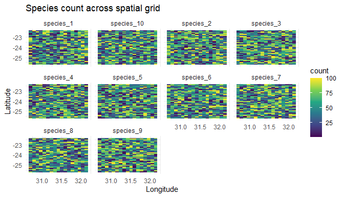

<!-- README.md is generated from README.Rmd. Please edit that file -->

# DissimMapR

<!-- badges: start -->

[](https://lifecycle.r-lib.org/articles/stages.html#stable)
[](https://github.com/macSands/DissimMapR/actions/workflows/test-coverage.yaml)
<!-- badges: end -->

The goal of DissimMapR is to collate SUN deliverables for EU Horizon B3
project: Biodiversity Building Blocks for Policy

## Installation

You can install the development version of DissimMapR from
[GitHub](https://github.com/) with:

``` r
# install.packages("devtools")
devtools::install_github("macSands/DissimMapR")
```

## Example

This is a basic example which shows you how to simulate ecological data
across a spatial and temporal grid, which can be used for testing
spatial analysis methods for [b-cube](https://b-cubed.eu/):

``` r
library(DissimMapR)
## basic example code
```

What is special about using `README.Rmd` instead of just `README.md`?
You can include R chunks like so:

``` r
summary(cars)
#>      speed           dist       
#>  Min.   : 4.0   Min.   :  2.00  
#>  1st Qu.:12.0   1st Qu.: 26.00  
#>  Median :15.0   Median : 36.00  
#>  Mean   :15.4   Mean   : 42.98  
#>  3rd Qu.:19.0   3rd Qu.: 56.00  
#>  Max.   :25.0   Max.   :120.00
```

You’ll still need to render `README.Rmd` regularly, to keep `README.md`
up-to-date. `devtools::build_readme()` is handy for this.

You can also embed plots, for example:


In that case, don’t forget to commit and push the resulting figure
files, so they display on GitHub and CRAN.

#### Simulating Data

We will start by simulating a basic dataset with default parameters.

``` r
# Set seed for reproducibility
set.seed(123)

# Simulate data
sim_data = dataSim(returnOption = 1, plot = FALSE)
#> Warning: [setValues] values is larger than the size of cells
#> Warning: [setValues] values is larger than the size of cells
head(sim_data)
#>            species
#> siteID      species_1 species_10 species_2 species_3 species_4 species_5
#>   Site_1_1       2535       2748      1692      2296       960      1755
#>   Site_1_10      1423       1970      1400      2225      1668      2083
#>   Site_1_11      2005       1681      2267      1770      2026      1468
#>   Site_1_12      1944       1536      1741      1660      2107       971
#>   Site_1_13      1696       3259      1465      1431      2299      1503
#>   Site_1_14      1981       1683      1446      2398      1998      2628
#>            species
#> siteID      species_6 species_7 species_8 species_9
#>   Site_1_1       1342      2307      1197      1996
#>   Site_1_10      2114      2211      2022      1947
#>   Site_1_11      1818      1710      1634      1879
#>   Site_1_12      2383      1934      2209      1850
#>   Site_1_13      1887      2407      1793      1691
#>   Site_1_14      1517      1871      1521      2145
```

#### Visualizing Data

If you want to visualize the spatial distribution of species counts, you
can set the plot parameter to `TRUE`. Here we demonstrate this with
`returnOption = 1`, which outputs a summary table of species by site and
plots the data.

``` r
# Generate data and plot
site_species = dataSim(returnOption = 1, plot = TRUE)
#> Warning: [setValues] values is larger than the size of cells
#> Warning: [setValues] values is larger than the size of cells
```



``` r
head(site_species)
#>            species
#> siteID      species_1 species_10 species_2 species_3 species_4 species_5
#>   Site_1_1       2183       1865      1634      2277      1163      2051
#>   Site_1_10      2079       2175      1359      2332      1416      1957
#>   Site_1_11      1588       2242      1897      1635      1794      2213
#>   Site_1_12      1894       1613      1833      1276      2119      2005
#>   Site_1_13      1947       1796      1210      1513      1407      2181
#>   Site_1_14      2333        916      2451      1687      2084      1415
#>            species
#> siteID      species_6 species_7 species_8 species_9
#>   Site_1_1       2036      1863      1829      1322
#>   Site_1_10      1257      1631      1619      1699
#>   Site_1_11      1219      1918      1988      2137
#>   Site_1_12      1594      1884      1853      1879
#>   Site_1_13      1821      2024      1872      2225
#>   Site_1_14      1668      2005      1452      1743
```

#### Advanced Usage

The `dataSim()` function can also return a `SpatRaster` object or a
distance matrix. Here’s how to use these options:

``` r
# Generate a SpatRaster object
raster_data = dataSim(returnOption = 2, plot = FALSE)
#> Warning: [setValues] values is larger than the size of cells
#> Warning: [setValues] values is larger than the size of cells
raster_data
#> class       : SpatRaster 
#> dimensions  : 38, 17, 1  (nrow, ncol, nlyr)
#> resolution  : 0.08983112, 0.08983112  (x, y)
#> extent      : 30.7, 32.22713, -25.7, -22.28642  (xmin, xmax, ymin, ymax)
#> coord. ref. : lon/lat WGS 84 (EPSG:4326) 
#> source(s)   : memory
#> name        : lyr.1 
#> min value   :     1 
#> max value   :   100

# Calculate and return a distance matrix
distance_matrix = dataSim(returnOption = 3, plot = FALSE)
#> Warning: [setValues] values is larger than the size of cells
#> Warning: [setValues] values is larger than the size of cells
head(distance_matrix)
#> [1] 24 49 12 41 38 17
```

#### Saving Data to the Global Environment

If you need to access the raw grid data for further analysis, you can
save it to the global environment using the globalSave option.

``` r
site_species = dataSim(returnOption = 1, plot = FALSE, globalSave = TRUE)
#> Warning: [setValues] values is larger than the size of cells
#> Warning: [setValues] values is larger than the size of cells
# head(site_species)

# Accessing the grid data from global environment
head(dataSim_grid)
#>          x     y       time   species count  class    envVar1     envVar2
#> 1 30.70000 -25.7 2020-01-01 species_9    47 native -0.2106676 -1.21716978
#> 2 30.78983 -25.7 2020-01-01 species_2    92 native  0.6251072  1.56526264
#> 3 30.87966 -25.7 2020-01-01 species_4    86  alien  0.4856711 -1.03212231
#> 4 30.96949 -25.7 2020-01-01 species_3    78 native  0.6603154 -0.75742823
#> 5 31.05932 -25.7 2020-01-01 species_7    45 native  1.1924688  0.12105208
#> 6 31.14916 -25.7 2020-01-01 species_2     4  alien  0.6165271 -0.02751404
#>       envVar3    envVar4   siteID
#> 1  0.03857866  2.4763263 Site_1_1
#> 2 -0.34717248  2.2953139 Site_2_1
#> 3 -0.71133191  0.5031918 Site_3_1
#> 4  0.91023745 -0.0875520 Site_4_1
#> 5 -1.01793483 -0.4027711 Site_5_1
#> 6  0.59913584  0.4136420 Site_6_1
```

#### Conclusion

This vignette has introduced the basic functionalities of the
`dataSim()` function. For more detailed information, please refer to the
package documentation.
